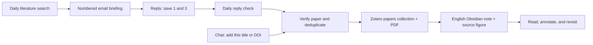

# Paper to Library

**Discover papers in your inbox. Reply with your picks. Read them in Obsidian. Keep the sources in Zotero.**

A personal research workflow built around AI-agent skills, daily email briefings, Zotero, and a local Obsidian vault. Originally developed for spatial omics and digital pathology; the research topics are configurable.



## What it does

- Curates a concise daily briefing with paper links, 1–2 sentence takeaways, and a short explanation of relevance.
- Accepts selections by email reply: item numbers, titles, or DOIs.
- Connects a reply to its original dated briefing, excluding quoted recommendations.
- Reuses existing Zotero entries, adds them to `papers`, and retrieves available PDFs.
- Writes an English Obsidian note with a journal-prefixed filename, full authors, publication dates, verified journal IF, a short takeaway, and an optional original figure.
- Tracks each selected paper separately so partial failures can be retried without duplicate imports.

**This is an agent-operated workflow kit.** Skills describe the research and app operations; a tested Python helper writes notes. It does not include a standalone Gmail polling server, Zotero API client, or scheduler. Your agent runtime supplies web access, an authenticated mail connector, local filesystem access, and Zotero UI or a verified API. A regular browser-only chat cannot write to your local library simply by loading a skill.

## Quick start

1. Install Zotero and Obsidian; create an Obsidian vault and a Zotero collection named `papers`.
2. Clone this repository and copy the example configuration:

   ```sh
   git clone https://github.com/liranmao/paper-to-library.git
   cd paper-to-library
   cp config/library.example.json library.local.json
   ```

3. Edit `library.local.json` with your vault path, sender/recipient addresses, research topics, and timezone. Keep it private.
4. Open this repository in your agent. Invoke the skills by their file paths, or install them in your runtime's supported skill directory. See [setup](docs/setup.md).
5. Test one manual import before enabling either schedule:

   > Use `skills/paper-to-library/SKILL.md` and `library.local.json` to add this paper: [title or DOI].

6. Connect your email account, then set up the two daily tasks in [automation prompts](docs/automations.md). Sending the briefing requires your explicit authorization for its recipient. The reply checker only reads mail.

## The reading experience

The Obsidian filename becomes the visible title:

> **NM：Original paper title**
>
> **Journal:** Nature Methods
>
> **Published:** Online date; issue date when different
>
> **Journal IF:** Verified value (metric year) · Source
>
> **Authors:** Full author list
>
> **Key takeaway**
>
> One or two sentences grounded in the paper.
>
> **Why it matters**
>
> One short phrase.
>
> *One relevant source figure, when available.*

No duplicate title in the body, no sprawling summary outline. Provenance and the Zotero link are stored in Obsidian comments. Use Reading view to hide `%%` markers; enable inline titles to display the filename. [Template details](docs/notes.md)

Journal prefixes: **NM** (Nature Methods), **NC** (Nature Communications), **Nature**, **Cell**, **Nat Med** (Nature Medicine). Other journals use their full names. The filename separator is a full-width colon for compatibility with Obsidian.

## Skills and files

| Path | Purpose |
| --- | --- |
| [`skills/daily-paper-briefing`](skills/daily-paper-briefing/SKILL.md) | Discover, verify, number, and email a daily digest |
| [`skills/briefing-replies`](skills/briefing-replies/SKILL.md) | Read selections, resolve the original briefing, and resume imports |
| [`skills/paper-to-library`](skills/paper-to-library/SKILL.md) | Verify a paper, link Zotero, and write its note |
| [`templates/concise-literature.md`](templates/concise-literature.md) | Optional Zotero Integration template with persistence regions |
| [`config`](config) | Portable example settings; no personal accounts |
| [`examples`](examples) | Synthetic briefing, reply, and note payload |
| [`docs/state.md`](docs/state.md) | Deduplication and recovery contract |

## Try the note generator without any connected accounts

Python 3.10+; standard library only. This synthetic example creates a note in a disposable demo vault and makes no network requests:

```sh
python3 skills/paper-to-library/scripts/write_note.py \
  --input examples/paper.json --vault /tmp/paper-library-demo --dry-run
python3 skills/paper-to-library/scripts/write_note.py \
  --input examples/paper.json --vault /tmp/paper-library-demo
python3 -m unittest discover -s tests -v
```

The script requires agent-verified metadata for real papers. It cannot look up a DOI, summarize a PDF, or create a Zotero item. Repeating the example write is intentionally rejected as a duplicate.

## Reliability and limits

Keep the local machine, vault, Zotero, and required connectors available for scheduled imports. Scheduler behavior and unattended permissions depend on your runtime. IF values need a metric year and a publisher/Clarivate source; unknown values remain `Not verified`. Abstract-only summaries are clearly marked. Original figures are optional and retain provenance; PDFs and figures are not bundled here.

The workflow was developed against a local macOS setup. The note helper is portable; other desktop environments and connector combinations need their own end-to-end test. Email interpretation and research synthesis are agent tasks, so ambiguous selections pause for clarification. No-op reply checks remain quiet.

[Setup](docs/setup.md) · [Schedules](docs/automations.md) · [Note format](docs/notes.md) · [Recovery](docs/state.md) · [Troubleshooting](docs/troubleshooting.md)

## License

MIT for this repository's code, templates, and instructions. Publisher articles and figures retain their original licenses.
