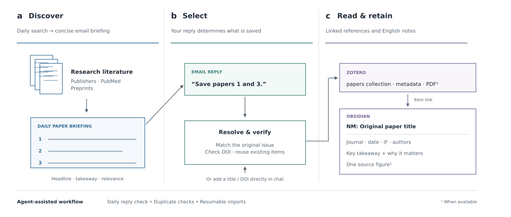

# Paper to Library

**Discover papers by email. Reply with your picks. Read in Obsidian, with sources in Zotero.**

An agent-assisted research workflow, built for spatial omics and digital pathology and adaptable to other topics.



Daily briefings contain numbered papers with concise takeaways. Reply with numbers, titles, or DOIs—or add a paper directly in chat. The agent checks for duplicates, saves references to Zotero’s `papers` collection, and creates English Obsidian notes with publication metadata, journal IF, key findings, and an optional source figure.

## Get started

```sh
git clone https://github.com/liranmao/paper-to-library.git
cd paper-to-library
cp config/library.example.json library.local.json
```

1. Set your vault path, email addresses, topics, and timezone in `library.local.json`.
2. Follow [setup](docs/setup.md) to connect email, Zotero, and Obsidian to your local agent.
3. Try a manual import:

   > Use `skills/paper-to-library/SKILL.md` and `library.local.json` to add: [title or DOI].

4. Enable the [daily briefing and reply-check schedules](docs/automations.md).

**Requires:** a local agent with web, email, filesystem, and Zotero access; Python 3.10+ for note generation. This repository provides skills, templates, and a note-writing helper. Your agent runtime supplies the connectors and scheduler.

## Skills

| Skill | Role |
| --- | --- |
| [Daily paper briefing](skills/daily-paper-briefing/SKILL.md) | Discover papers and email a numbered digest |
| [Briefing replies](skills/briefing-replies/SKILL.md) | Resolve explicit selections and resume incomplete imports |
| [Paper to library](skills/paper-to-library/SKILL.md) | Verify papers, update Zotero, and create Obsidian notes |

[Note format](docs/notes.md) · [Examples](examples) · [Recovery](docs/state.md) · [Troubleshooting](docs/troubleshooting.md)

Run checks with `python3 -m unittest discover -s tests -v`. The [figure source](scripts/render_workflow.py) exports SVG and PNG with Matplotlib.

MIT license. Articles and figures retain their original licenses. Personal configuration and reading history stay local.
